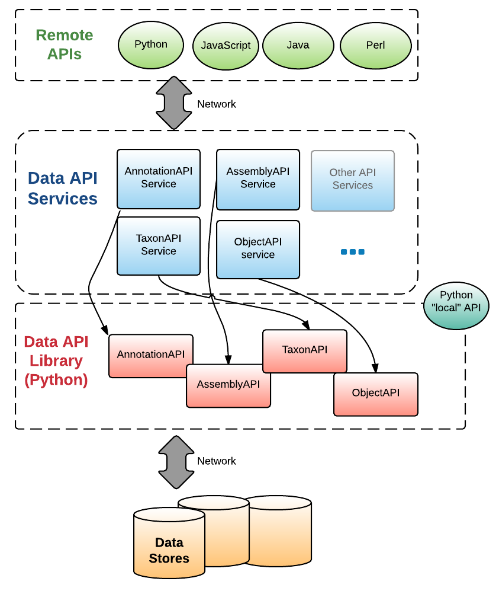

.. lib documentation master file, created by
   sphinx-quickstart on Fri Aug  7 16:25:28 2015.
   You can adapt this file completely to your liking, but it should at least
   contain the root `toctree` directive.

.. toctree::
    :maxdepth: 4

    annotation_api
    assembly_api
    taxon_api
    developer
    
TODO: API Reference <_modules/index.html>

KBase Data API documentation
============================
The Data API provides a unified entry point to retrieve and, eventually,
store KBase data objects. This page covers concepts and installation instructions.
For usage see the individual API pages for the :ref:`annotation_api`, :ref:`assembly_api` , and :ref:`taxon_api`.

Developers should read the :ref:`developer_notes`.

.. Skip this for now: contents:: Contents

Concepts
--------

The Data API is multi-language, with the primary language implementation being Python. We are using Thrift to generate consistent language APIs in other languages. In all languages except Python, the implementation is a client/server, with a Python-based server and the other language as the client. The diagram below summarizes this design.

.. _overview_diagram:

    
    Overview of the Data API modules
    
Install
-------

You can download the latest release of the Data API from the [release page on github](https://github.com/kbase/data_api/releases). It is generally recommended that you install packages in a virtual environment.

1. Install virtualenv using your local installer e.g., apt-get install virtualenv

2. Create a virtualenv environment to install the source to e.g.::

    virtualenv venv

3. Activate the virtualenv::

    source venv/bin/activate

You can get out of the virtualenv environment with "deactivate".
    
4. Set your ``KB_AUTH_TOKEN`` to your token string.

.. include:: kbauth.txt

Unpackage the download file, change into the top-level directory, then run the standard Python setup command::

    python setup.py install

5. Run the tests, which are designed to use ``nosetests``::

    nosetests

.. note:: You can re-run ``python setup.py install`` if you have edited files locally and want to test them out without having to reset the virtualenv.

Hello, World
------------

A simple hello, world example will be here "real soon now".

For more examples, see the object API pages for the :ref:`annotation_api`, :ref:`assembly_api` , and :ref:`taxon_api`.

Indices and tables
==================

* :ref:`genindex`
* :ref:`modindex`
* :ref:`search`

